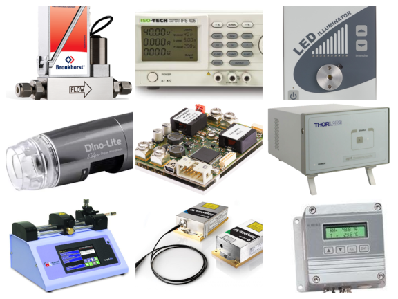

# MATLAB classes for device control

## About

This repository contains various MATLAB classes for controlling and communicating with different types of devices and instruments that I have utilised in the laboratory for building and developing experimental setups.

## Use

> [!CAUTION]
> You will need to come up with your own wiring, power supplies and other things not shown here. Please be careful and read the uploaded pdf manuals and examples provided.

You can communicate with devices by creating objects either in the MATLAB command window or in applications developed with App Designer.

For example, set a MATLAB timer to call `Refresh()`, `GetStatus()`, etc. functions to query the status of the device in MATLAB applications and update the GUI accordingly.

The implemented functions return booleans that can be used for error checking.

## Compatibility

The classes include only the functionality that was necessary for my work.

To help everyone out, please let me know the model numbers of any devices that work but are not listed in the documentation.

## Examples with GUI?

No, the focus here is on the practical control of devices. It is up to you to develop the MATLAB apps.
