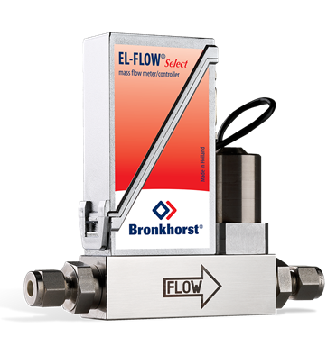

# Bronkhorst mass flow controllers



- Tested models:
  - F-201CV
  - F-202AV
- MATLAB compatibility: 2022b or newer (uses 'dictionary')

## Notes

- Before use, ensure functional connection with Bronkhorst's software (e.g., FlowDDE & FlowView) and check the `Node`, `Process`, etc. numbers of your device!
- Some commands are preformed. Command string formation needs to be further developed for more sophisticated control
- Command string formation also affects chaining that is not yet supported, as I am not using multiple controllers. However, commands are already formed from many "subparts" (e.g., `Node`, `Process`, etc.), which should make implementation of chaining more convenient in the future
- All parameters and settings are listed in the Bronkhorst document 9.17.027AK (Date: 18-12-2023) (RS232 interface with ProPar protocol for digital multibus Mass Flow / Pressure instruments)
- Floating-point numbers are in 32-bit single-precision floating-point format (IEEE-754), e.g., float 3F800000 = dec 1 (i.e. hex2dec does not return a correct answer)

## Known bugs

- Writing `ControlMode` does not work correctly. Sometimes the read values are zeros, which is similar to having the wrong mode set on the device. However, after connecting via Bronkhorst's software, everything works fine.

## Examples

```
elf = BronkhorstController("COM17", 1, 1); % Initialise a EL-FLOW controller (COM port, Node number, Process number: check/set these with FlowDDE)
elf.Connect(); % Create and open serialport/RS232 connection
elf.Refresh(); % Refresh values
elf.LogSet(file_path); % Set log file path. This does not enable logging!
elf.IsLogging = true; % Enable logging. Values are saved to a file set with .LogSet() each time the device values are read
elf.WriteSetpoint(0); % Set the flow off
elf.WriteSetpoint(6400); % Set the target flow value with an integer value (equals 20% output if the MaxSetpoint value of the controller is 32000)
elf.WriteSetpoint(0.2); % Set the target flow value as a percentage (< 1) (equals 6400 if the MaxSetpoint value of the controller is 32000)
elf.Measure(); % Read the current flow rate (use with MATLAB timers for example): the internal PID controller of the device should set the flow rate to the setpoint value
elf.Disconnect(); % Close the serialport connection and reset values
delete(elf); % Delete the MATLAB object
```
