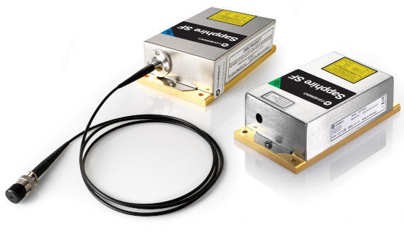

# Coherent Sapphire FP series lasers



- Tested models:
  - 548-300 FPT FT
- MATLAB compatibility: 2019b or newer (uses 'serialport')

## Notes

- Laser PCB DIP switch states:
  1. ON
  2. ON
  3. ON
  4. OFF
- Does not check for interlocks! See manual for all available commands and error codes

## Fault codes

| Code | Fault |
| :--- | :--- |
| 0 | Error-free in standby mode |
| 256 | Laser is powering up |
| 8192 | Error-free when the laser servo is on |
| -1 | No value returned, laser is powered off? |

## Examples

```
sap = SapphireLaser("COM27"); % Initialize the Coherent Sapphire laser with its COM port
sap.Connect(); % Create and open serialport/RS232 connection
sap.Initialize(); % Disables prompt and echo
sap.Refresh(); % Read and refresh values (e.g., with app timers)
sap.SetServoState(1); % Enable the servo → beam
sap.SetPower(100); % Set the laser power, see [MIN_LASER_POWER - MAX_LASER_POWER]
sap.SetServoState(0); % Disable the servo → no output
sap.Disconnect(); % Close the serial port connection
delete(sap); % Delete the MATLAB object
```
