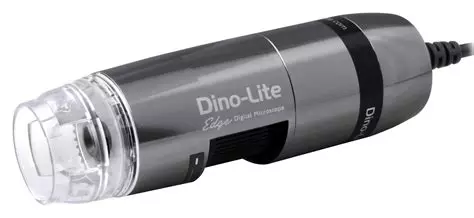

# Dino-Lite digital microscopes



- Tested models:
  - Edge AM7115
  - Edge AM7915
- MATLAB compatibility: Unknown!

## Notes

- LED control requires Dino-Lite DOS Control .exe file (modify the `EXE_PATH`)
- `DeviceID` (cam index) is currently based on the order cameras were attached to the PC
- Use the device name instead of `DeviceID` number if the camera names are unique. For example, two 'Edge' series cameras had equal device names and thus they could not be used as unique identifiers

## Examples

```
dino = DinoLite(); % Initialise a Dino-Lite digital microscope
dino.Connect(1); % Connect to a Dino-Lite microscope with a DeviceID = 1 and apply the predetermined settings for the camera (see .Connect())
app.dino.SetROI([0 142 1600 916]); % Crop 1600x1200 feed to 1600x916 [X Y Width Height]
app.dino.Source.Brightness = Some_Brightness_Slider.Value; % Set camera settings to match with some app slider values (or other way around)
app.dino.Source.Contrast = ...
app.dino.Source.Gamma = ...
app.dino.Source.Sharpness = ...
dino.ToggleLEDs()); % Sets all individual LED states to false or true regardless of their individual states
dino.LED1 = true; % Set LED1 state to ON
dino.SetLEDs()); % Update the camera LED states as set above
dino.SetLEDBrightness(3); % Set the LEDs brightness to level 3
delete(dino); % Delete/disconnect
```
