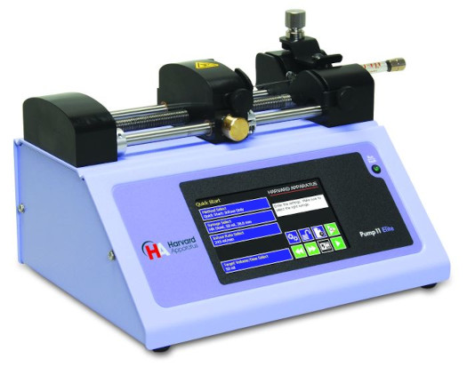

# Harvard Apparatus syringe pumps



- Tested models:
  - Pump 11 Elite Infusion Only (70-4500)
- MATLAB compatibility: 2022b or newer (uses 'dictionary')

## Notes

- Created for a syringe pump that can only infuse samples (no withdraw), add all withdraw features to the class and commands from the manual if necessary

## Examples

```
hap = HarvardApparatus("COM10"); % Initialise Harvard Appratus syringe pump with its COM port
hap.Connect(); % Create and open serialport/RS232 connection
hap.Initialize(); % Set all object values to match with the pump values
hap.SetDiameter(4.608); % Set syringe diameter in millimeters
hap.SetForceLevel(int8(40)); % Set the pumping force level in percentage units with an integer (!), see the manual for a suggested level for each syringe 
hap.SetInfusionRate(0.4); % Set the infusion flow rate to 0.4 µL (see Units{2})
hap.SetTargetVolume(1000); % Set the target volume to 1000 µL (see Units{1})
hap.Infuse(); % Start infusing
hap.Refresh(); % Read and refresh values (e.g., with app timers)
hap.Stop(); % Stop pumping
hap.Flush(); % Flush the serialport (minor error)
hap.Reset(); % Try to reset the connection (major error)
hap.Disconnect(); % Close the serialport connection
delete(hap); % Delete the MATLAB object
```
