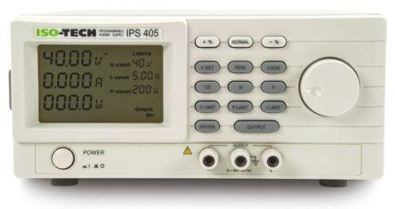

# ISO-TECH IPS power supplies



- Tested models:
  - IPS-603 (60 V / 3.5 A)
  - IPS-2010 (20 V / 10 A)
- MATLAB compatibility: 2022b or newer (uses 'dictionary')

## Notes

- Maximum current, voltage, and load values of the power supply could be read from the device itself
- Class constructor requires the user to input the `MaxCurrent`, `MaxVoltage`, and `MaxLoad` values on purpose for the user to study their device and its limits

## Examples

```
ips = IsotechIPS("COM22", 3.5, 60, 210); % Initialise ISO-TECH IPS power supply with its COM port, MaxCurrent, MaxVoltage, and MaxLoad values
ips.Connect(); % Create and open serialport/RS232 connection
ips.Initialize(); % Set all object values to match with the PSU values
ips.SetOutputVoltage(12.0); % Set output voltage to 12.0 V
ips.SetCurrentLimit(1.0); % Limit maximum amperage to 1.0 A
ips.On(); % Output on
ips.Refresh(); % Read and refresh values (e.g., with app timers)
ips.Off(); % Output off
ips.ToggleRelay(); % Output off/on
ips.Flush(); % Flush the serialport (minor error)
ips.Reset(); % Try to reset the serial port connection (major error)
ips.Disconnect(); % Close the serial port connection
delete(ips); % Delete the MATLAB object
```
