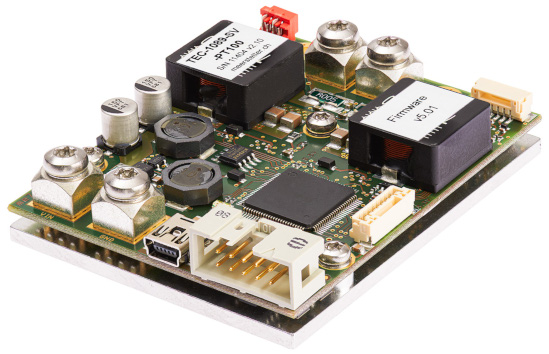

# Meerstetter TEC controllers



- Tested models: TEC-1089
- Supported TEC models: 1089, 1090, 1091, 1092, 1122, 1123, 1161, 1162, 1163, 1166, 1167 (based on the communication protocol pdf)
- MATLAB compatibility: 2022b or newer (uses 'dictionary')

## Notes

- All temperatures are in degrees Celsius
- Check all available parameter IDs: Meerstetter MeCom communication protocol 5136
- Written for a 1-channel model, you will need to add parameters/functions for the second channel

## Examples

```
tec = MeerstetterController("COM9", 1); % Initialize the Meerstetter TEC controller with its COM port and number of available channels (see the specs of your device)
tec.Connect(); % Create and open serialport/RS232 connection
tec.LogSet(tec_logfile_path); % Set the log file path. Does not start logging!
tec.SetTargetTemp(10.0, 1); % Sets the target temperature of Channel/Instance 1 to 10 degrees Celcius
tec.Enable(1); % Enable temperature control of Channel/Instance 1 --> Tries to reach obj.TempTarget
tec.IsLogging = true; % Enable logging. Values are saved to a file set with .LogSet() each time the .Refresh() function is called
tec.Refresh(1); % Update Channel/Instance 1 values (use with MATLAB timers)
tec.Disable(1); % Disable temperature control
tec.Disconnect(); % Close the serialport connection
delete(tec); % Delete the MATLAB object
```
