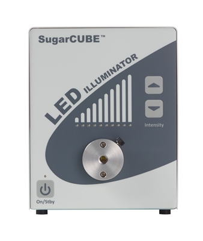

# SugarCUBE™ LED Illuminators



- Tested models:
  - White with a firmware version 01.05.00
- MATLAB compatibility: 2022b or newer (uses 'dictionary')

## Notes

- RS-232 commands can use upper or lower case characters
- Firmware versions 01.01.00 and newer are supported. For firmware version 01.00.00 all commands except `.Brighten()` ('^') and `.Dim()` ('v') are valid

## Examples

```
scube = Sugarcube("COM26"); % Initialise SugarCUBE LED illuminator
scube.Connect(); % Create and open serialport/RS232 connection
scube.Initialize(); % Set all object values to match with the illuminator values
scube.Refresh(); % Read and refresh values (e.g., with app timers)
scube.On(); % Turn on the lamp
scube.Intensity(30); % Sets illumination intensity to 30%
scube.Standby(); % Turn off the lamp
scube.Flush(); % Flush the serialport (minor error)
scube.Reset(); % Try to reset the serial port connection (major error)
scube.Disconnect(); % Close the serial port connection
delete(scube); % Delete the MATLAB object
```
