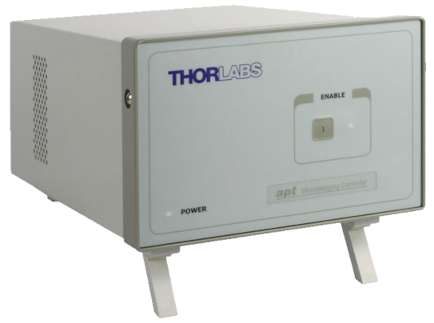

# Thorlabs stage controllers



- Tested benchtop controllers:
  - BSC-202 (two-channel benchtop stepper motor controller)
- Tested stage controllers:
  - TDC001 (T-Cube DC servo motor controller)
- MATLAB compatibility: Unknown!

## Notes

- Installation of Thorlabs Kinesis software is required, see the `LIB_PATH` !
- Each ThorlabsBenchtop controller `Channel` will point to a separate `ThorlabsStage` object for which there is a separate MATLAB class
- Check the `.SetCalibrationFile()` function in `ThorlabsStage` file to include your stage .dat calibration file provided by Thorlabs!

## Examples

### Benchtop controller

```
xy = ThorlabsBenchtop(); % Create a Thorlabs benchtop controller
xy.Connect('70862881'); % Connect to a stage using a deviceID. Benchtop controller class connects to all stages via different Channels. This also sets the calibration file defined in ThorlabsStage!
x = xy.Channel{1}; % Create a separate handle for the X and Y stages for more convenient access
y = xy.Channel{2};
x.SetVelocityParameters(1.0, 0.5); % Set the velocity and accelaration of the X stage
x.MoveTo(12.5); % Moves the X stage to the coordinate X = 12.5
x.MoveRelative(10.0); % Moves the X stage to the coordinate X = 22.5 (+10)
x.Refresh(); % Refresh the stage values
x.Motor.IsDeviceBusy(); % Use this (true/false) with a MATLAB timer to disable certain GUI features when the device is moving
xy.Disconnect(); % Disconnect the stages and benchtop controller (NB! xy)
delete(xy); % Delete the MATLAB controller object
```

### Stage controller

```
z = ThorlabsStage(); % Create a Thorlabs stage object
z.Connect('83817592'); % Connect to a stage using its serial number (deviceID)
z.Initialize(); % Initialize all settings and enable the stage
z.SetCalibrationFile(); % Attaches the .dat calibration data file to the stage based on its deviceID, if it has any (add yours): see the function SetCalibrationFile()!
z.SetVelocityParameters(1.0, 0.2); % Set the velocity and accelaration for Z stage
z.MoveTo(5.0); % Moves the Z stage to the coordinate Z = 5.0
z.MoveRelative(8.0); % Moves the Z stage to the coordinate Z = 13.0 (+8)
z.Refresh(); % Update stage info
z.Motor.IsDeviceBusy(); % Use this (true/false) with a MATLAB timer to disable certain GUI features when the device is moving
z.Disconnect(); % Disconnect the stage
delete(z); % Delete the MATLAB stage object
```
