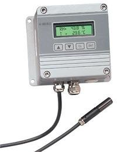

# Vaisala HMP230 series humidity and temperature transmitter



- Tested models:
     - HMP 233
- MATLAB compatibility: 2022b or newer (uses 'dictionary')

## Notes

- Remove the security lock jumper! Use the HMP panel to set the unit configuration (read the manual)

## Input command formatting

| Symbol  | Meaning |
| :---  | :---  |
| \UU..UU\ | relative humidity |
| \TT..TT\ | temperature |
| \DD..DD\ | dewpoint temperature |
| \AA..AA\ | absolute humidity |
| \XX..XX\ | mixing ratio |
| \WW..WW\ | wet bulb temperature |
| \HH..HH\ | enthalpy |
| \uu..uu\ | unit according to the preceding variable |
| \n | line feed \<lf\> |
| \r | carriage return \<cr\> |
| \t | horizontal tabulation \<ht\> or \<tab\> |
| \\ | \ |

> [!NOTE]
> You can type your own text into the input command and it will appear in the output:

| Input  | Output |
| :---  | :---  |
| RH: \UUU.U\ T: \+TT.TT\\r | RH: 54.0 T: +25.20 \<cr\> |
| \UUU.UU\ \+TT.TT\\r | 100.00 +99.99 \<cr\> |
| \TTT.T\ \uu\\r\n | 15.2 'C \<cr\>\<lf\> |
| \UUU.U\ \uuu\\+DD.D\ \uu\\r | 46.9 %RH +10.8 'C \<cr\> |

## Examples

```
hmp = VaisalaHMP("COM21"); % Initialise Vaisala HMP transmitter object (COM port)
hmp.PollingInterval = 10; % Optionally set polling interval and its unit, such as 's' for seconds (10 s)
hmp.PollingIntervalUnit = 's';
hmp.Connect(); % Create and open serialport/RS232 connection
hmp.Initialize(); % Initialize all HMP default and restored settings, as also set in hmp object
hmp.LogSet(path_logfile); % Optionally set log file path. This does not start logging, use LogData and LogClose with a MATLAB timer instead.
hmp.IsLogging = true; % Enable logging. Values are saved to a file set with .LogSet() each time the device values are read
hmp.Measure(); % Read values
hmp.Disconnect(); % Close serialport connection
delete(hmp); % Delete the MATLAB object
```
